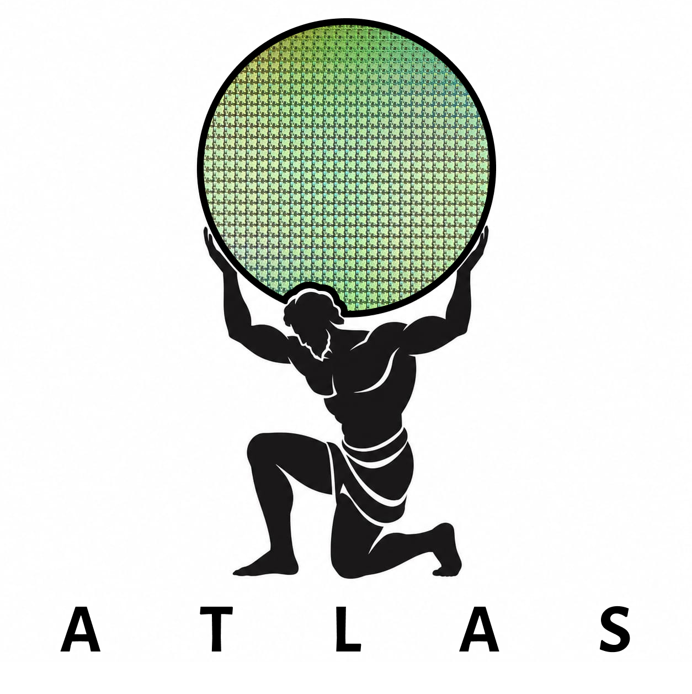

# ATLAS: Automated Timing, Logic, Area and Statistics

<p align="center">
  
</p>

ATLAS is an open-source tool for automating the analysis and evaluation of digital hardware designs.

The goal of ATLAS is to provide a simple workflow for processing HDL designs and extracting useful hardware metrics such as:

- **Timing** — delay and timing characteristics
- **Logic** — synthesized logic and gate information
- **Area** — estimated circuit area
- **Statistics** — summarized design and synthesis statistics

ATLAS aims to integrate existing open-source EDA tools into a simple and automated workflow, allowing hardware designers and researchers to quickly evaluate SystemVerilog and Verilog designs.

## Status

🚧 ATLAS is currently under development.

## Dependencies

ATLAS relies on the following open-source EDA tools:

- [Yosys](https://github.com/YosysHQ/yosys) — RTL synthesis
- [OpenROAD](https://github.com/The-OpenROAD-Project/OpenROAD) — physical design, timing, and power analysis (integration in progress)

It also uses [nlohmann/json](https://github.com/nlohmann/json) for parsing and generating JSON reports.

### Yosys version requirement

ATLAS requires a **recent build of yosys** (0.6x or newer). Many Linux distributions (e.g. Ubuntu) ship a much older packaged version — `apt install yosys` on Ubuntu 22.04 currently installs `0.9`, which is missing several passes and options ATLAS depends on (e.g. `synth -noabc`, newer `read_verilog` flags, and various liberty-parsing fixes).

**Do not rely on your distro's package manager for this.** Install a current build via **OSS CAD Suite** instead — prebuilt nightly binaries maintained by YosysHQ that bundle Yosys, ABC, and related tools.

#### Installing OSS CAD Suite

```bash
# Get the latest release download URL for your platform (linux-x64 shown here)
curl -s https://api.github.com/repos/YosysHQ/oss-cad-suite-build/releases/latest \
  | grep "browser_download_url.*linux-x64" \
  | cut -d '"' -f 4

# Download and extract (replace with the URL printed above)
curl -L -o oss-cad-suite.tgz "<paste URL here>"
tar xzf oss-cad-suite.tgz

# Activate it in your current shell
source oss-cad-suite/environment

# Confirm the upgrade
yosys -V
```

This only affects your **current shell session**. To make it permanent, add the `source` line to your shell startup file:

```bash
echo 'source ~/oss-cad-suite/environment' >> ~/.zshrc   # or ~/.bashrc
```

Binaries are available for Linux (x64/arm/arm64/riscv64), macOS (Intel/M1/M2), and Windows x64 — grab the asset matching your platform from the [releases page](https://github.com/YosysHQ/oss-cad-suite-build/releases).

> **Note:** `/dev/stdin`-based input and some hierarchy-resolution passes require an actual seekable file — ATLAS always reads your design from its real file path on disk rather than piping content through stdin, so this isn't something you need to worry about day-to-day; it's just why ATLAS's internals invoke yosys the way they do.

## Building

```bash
sudo apt install nlohmann-json3-dev   # or install the header manually

make
```

This produces an `atlas` binary in the project root.

For a debug build (with symbols, no optimization):

```bash
make debug
```

To clean build artifacts:

```bash
make clean
```

## Usage

```bash
./atlas <design.sv> <top_module> <liberty_file.lib>
```

Or via the Makefile's `run` target:

```bash
make run ARGS="rtl/LOD8.sv LOD8 liberty/sky130_fd_sc_hd__tt_025C_1v80.lib"
```

Example:

```bash
./atlas rtl/LOD8.sv LOD8 liberty/sky130_fd_sc_hd__tt_025C_1v80.lib
```

This will:

1. Synthesize `<design.sv>` with Yosys, targeting `<top_module>` as the top-level module.
2. Map the design to standard cells using `<liberty_file.lib>`.
3. Extract area, cell count, and structural statistics.
4. (Timing and power analysis via OpenROAD are in progress.)
5. Write a JSON report to `output.json`.